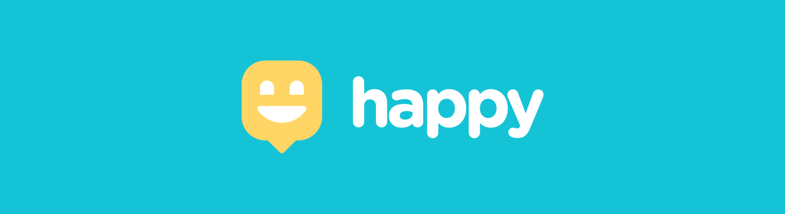

  

  
  

  
  
  

## 📓 Resumo
- [Sobre o projeto](#sobre-o-projeto)
- [Organização do projeto](#organização-do-projeto)
- [Feito por](#feito-por)
- [License](#license)

## ❓ Sobre o projeto
Aplicação criada o evento **Next Level Week** na sua 3° edição, oferecido pela **Rockeseat**. O projeto visa a implementação de uma plataforma que facilite o encontro de orfanatos por pessoas querem visita-los. O objetivo principal da visita é mudar o dia de uma criança. Que tal levar um pouco de felicidade para o mundo?  

## ⏳ Overview
- [ ] [Backend](https://github.com/LucianoWeslen11/happye)
- [ ] [Frontend](https://github.com/LucianoWeslen11/happy)
- [ ] [Mobile](https://github.com/LucianoWeslen11/happy)

## 👨‍💻 Feito por
<table>
  <tr>
    <td align="center"> <b><a href="https://linkedin.com/in/lucianoweslen11" title="Luciano">Luciano W. da Silva</a></b> Desenvolvedor Web</td>
  </tr>
</table>

## 📜 License
O projeto está sobre a licença [MIT](./LICENSE)

>Aproveite todos os momentos 🧡